# AI Production Support Platform — Full Architecture

## 1. Architecture Scope

This document combines the implemented Day 1–10 platform and the planned Day 11–22 evolution.

Legend:

- **Current** — capability already represented in the repository.
- **Planned** — roadmap capability to be implemented in upcoming days.

---

# 2. System Context

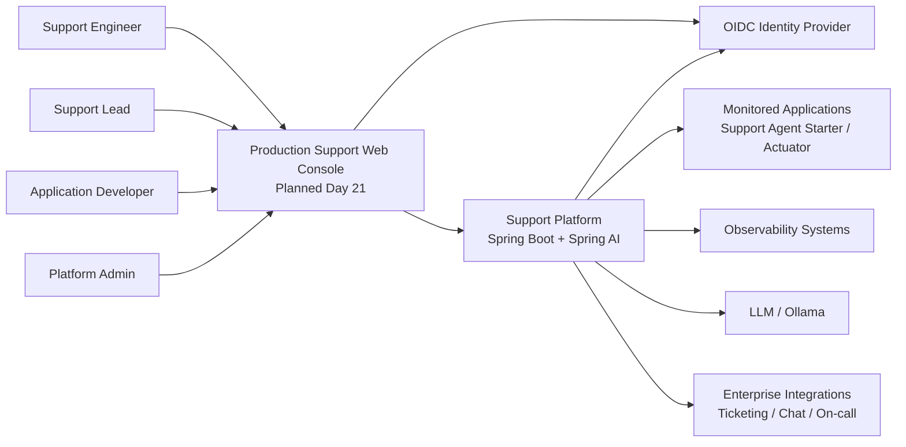

---

# 3. Container Architecture

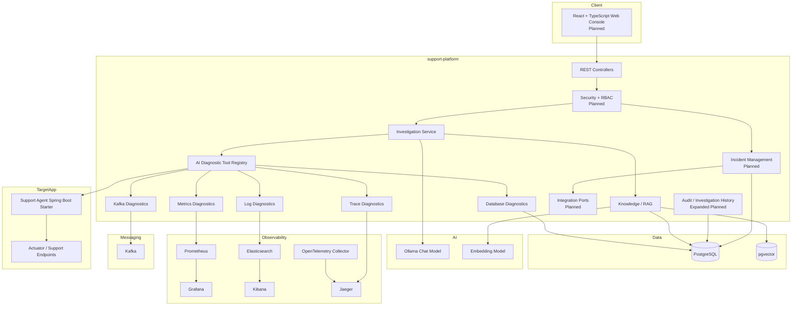

---

# 4. Backend Component Architecture

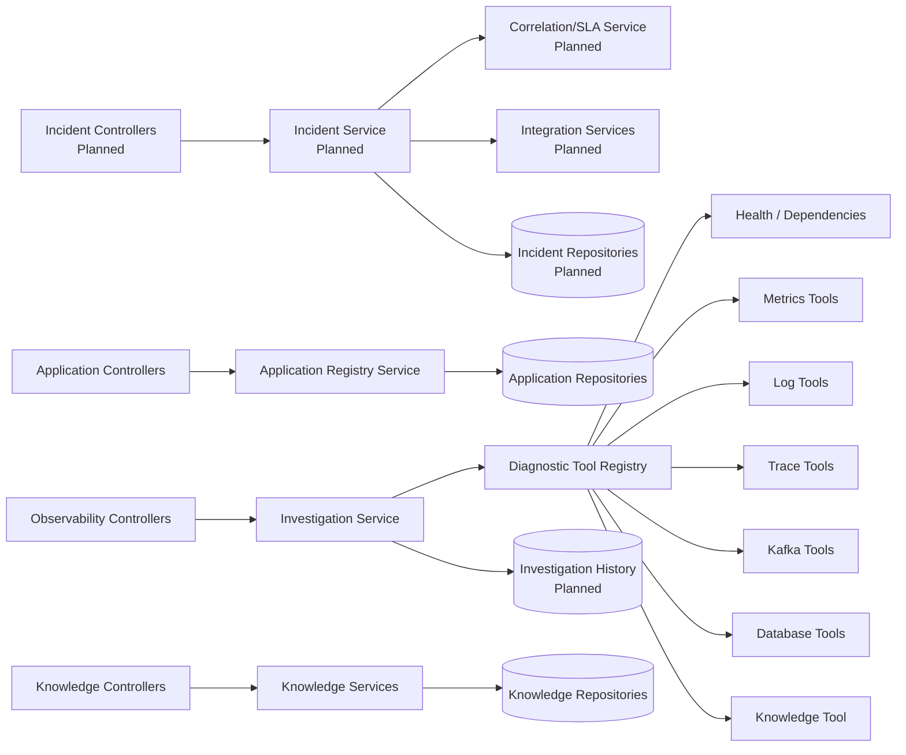

---

# 5. AI Investigation Sequence

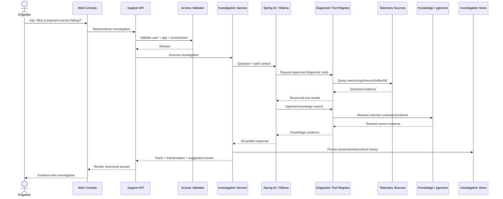

---

# 6. Incident Lifecycle Architecture

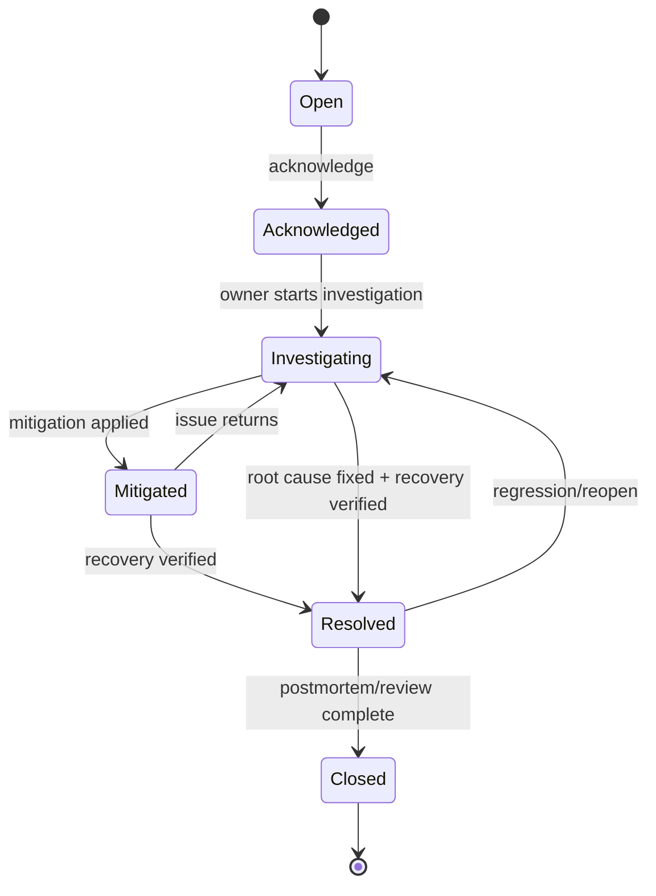

AI can recommend actions or draft summaries, but human-authorized operations control state transitions.

---

# 7. Signal-to-Incident Data Flow

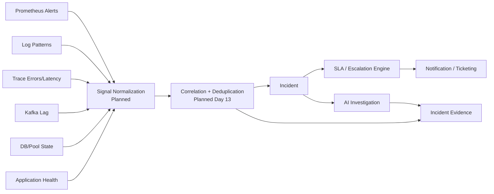

---

# 8. RAG / Knowledge Architecture

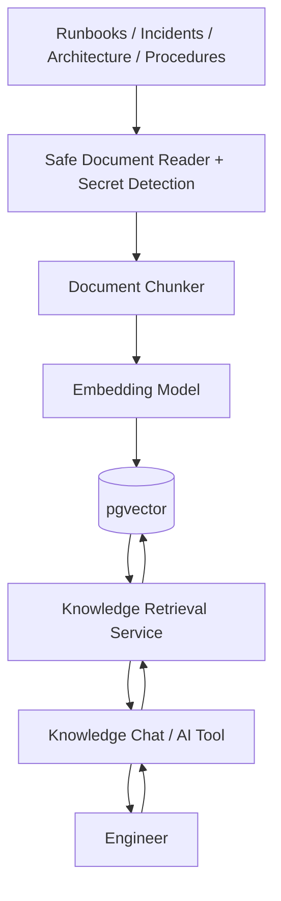

The retrieval layer should return source metadata so the UI can expose evidence cards and source links.

---

# 9. Observability Architecture

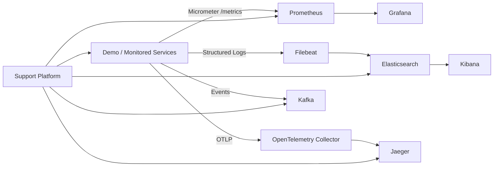

---

# 10. Security Boundaries

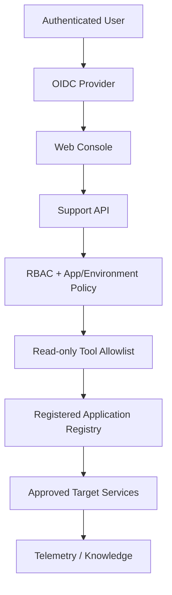

Security rules:

1. The model does not choose arbitrary network destinations.
2. Application URLs come from the verified application registry.
3. Tools are allowlisted.
4. Diagnostic operations remain read-only.
5. sensitive values are sanitized before model/UI exposure.
6. Day 14 adds user role plus application/environment authorization.
7. All human operational actions are audited.

---

# 11. External Integration Architecture — Planned

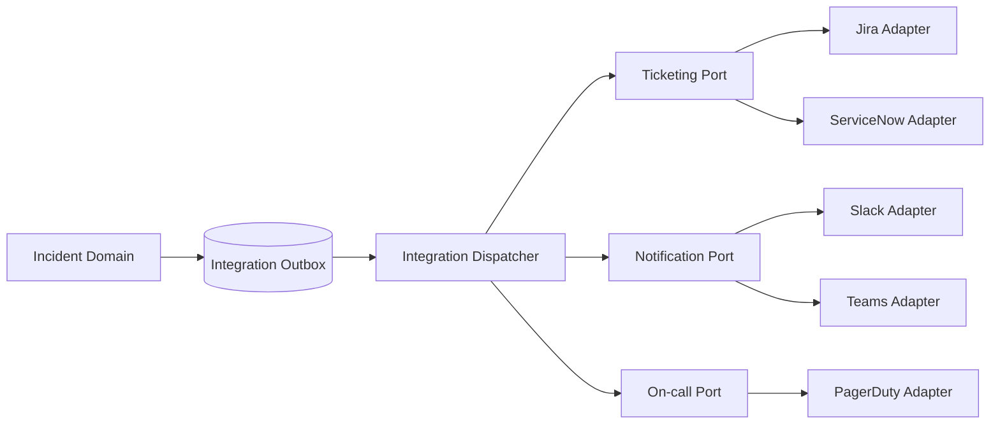

Core incident persistence must not depend on external SaaS availability.

---

# 12. Deployment Topology

```mermaid
flowchart TB
    subgraph UserZone[User Zone]
        BROWSER[Browser]
    end

    subgraph Cluster[Kubernetes / OpenShift]
        ING[Ingress / Route]
        UI[Web Console Pod(s)]
        API[Support Platform Pod(s)]
        CFG[ConfigMap]
        SEC[Secret References]
    end

    subgraph DataZone[Data Services]
        PG[(PostgreSQL + pgvector)]
        KAFKA[(Kafka)]
        ES[(Elasticsearch)]
        PROM[(Prometheus)]
        JAEGER[(Jaeger)]
    end

    subgraph AIZone[AI Runtime]
        MODEL[Ollama / Configured LLM Endpoint]
        EMB[Embedding Model]
    end

    subgraph Apps[Monitored Applications]
        A1[Application A]
        A2[Application B]
        AN[Application N]
    end

    BROWSER --> ING
    ING --> UI
    UI --> API

    CFG --> API
    SEC --> API

    API --> PG
    API --> KAFKA
    API --> ES
    API --> PROM
    API --> JAEGER
    API --> MODEL
    API --> EMB

    API --> A1
    API --> A2
    API --> AN
```

---

# 13. High Availability Considerations

For production readiness:

- run multiple stateless support-platform replicas;
- externalize sessions/investigations to PostgreSQL;
- do not rely on in-memory telemetry for cross-replica history;
- configure database pool limits per replica;
- use readiness/liveness/startup probes;
- apply bounded retries/circuit breakers;
- protect AI/observability endpoints with rate limits;
- define retention for incidents, audits and investigation evidence.

---

# 14. Data Ownership

| Data | System of Record |
|---|---|
| Registered applications | PostgreSQL |
| Diagnostic configurations | PostgreSQL |
| Knowledge metadata | PostgreSQL |
| Embeddings | pgvector |
| Incident lifecycle | PostgreSQL — planned |
| Investigation history | PostgreSQL — planned |
| Metrics | Prometheus |
| Logs | Elasticsearch |
| Traces | Jaeger |
| Kafka offsets/lag | Kafka |
| AI model state | External/model runtime; do not treat as system of record |

---

# 15. End-to-End Operational Flow

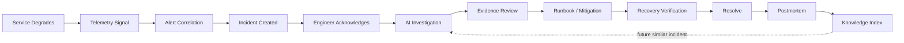

This is the target product loop: every resolved incident should make the next incident easier to diagnose.
