# AI Production Support Platform — UX Architecture

## 1. Product UX Goal

Design a calm, evidence-first production support workspace that helps support engineers move from **signal → incident → investigation → mitigation → resolution → learning** without jumping across many tools.

The interface must make a clear distinction between:

- **Observed facts** — telemetry, alerts, logs, traces, Kafka/DB state.
- **AI interpretation** — probable cause, correlation, explanation.
- **Suggested actions** — runbook steps and next checks.
- **Human decisions** — acknowledge, assign, escalate, mitigate, resolve.

The AI must never visually look like a source of truth when the underlying evidence is incomplete.

---

## 2. Primary Users

### Support Engineer
Main goal: understand what is broken, find evidence, mitigate quickly and document the incident.

### Support Lead
Main goal: prioritize incidents, assign owners, monitor SLA/escalations and approve resolution.

### Application Owner / Developer
Main goal: inspect technical evidence, traces, logs, metrics and related deployments.

### Administrator
Main goal: onboard applications, configure data sources, access rules and integration settings.

### Read-Only Viewer
Main goal: monitor service health and incident status without changing operational state.

---

## 3. Information Architecture

```mermaid
flowchart TD
    ROOT[Production Support Console]
    ROOT --> DASH[Overview]
    ROOT --> INC[Incidents]
    ROOT --> INV[Investigations]
    ROOT --> OBS[Observability]
    ROOT --> KB[Knowledge]
    ROOT --> APP[Applications]
    ROOT --> ADMIN[Administration]

    INC --> INC1[Active Incidents]
    INC --> INC2[Incident Detail]
    INC --> INC3[Postmortems]

    INV --> INV1[Investigation Sessions]
    INV --> INV2[AI Investigation Workspace]
    INV --> INV3[Investigation History]

    OBS --> MET[Metrics]
    OBS --> LOG[Logs]
    OBS --> TRC[Traces]
    OBS --> KAF[Kafka]
    OBS --> DB[Database]

    KB --> RUN[Runbooks]
    KB --> DOC[Knowledge Documents]
    KB --> SIM[Similar Incidents]

    APP --> REG[Registered Applications]
    APP --> CFG[Diagnostic Configuration]
    APP --> ENV[Environment Access]

    ADMIN --> USR[Users and Roles]
    ADMIN --> INT[Integrations]
    ADMIN --> POL[SLA and Escalation Policies]
    ADMIN --> AUD[Audit]
```



---

## 4. Global Navigation

### Desktop

Use a persistent left sidebar.

Primary items:

1. Overview
2. Incidents
3. Investigations
4. Observability
5. Knowledge
6. Applications
7. Administration

Utility items:

- Environment switcher
- Global search
- Notifications
- User/profile menu
- System health indicator

### Tablet

Use a collapsible sidebar.

### Mobile

Mobile is secondary for operational work. Support:

- Incident list
- Incident detail
- acknowledge/assign
- notifications
- read-only evidence summary

Deep log/trace analysis should remain optimized for desktop.

---

## 5. UX Principles

### Evidence First

Every diagnostic conclusion must provide an evidence trail.

Recommended component pattern:

```text
Observed Facts
-------------
3 active alerts
HTTP 5xx = 14.2%
DB pool = 100%
Trace p95 = 4.8s

AI Interpretation
-----------------
DB connection pool exhaustion is strongly correlated
with the current HTTP failure spike.

Suggested Next Actions
----------------------
1. Inspect active DB sessions.
2. Check recent deployment/config change.
3. Follow payment-service DB pool runbook.
```

### Progressive Disclosure

The default incident page shows the most useful summary first.

Detailed raw telemetry is available through tabs/drawers.

### Safe Operational Actions

Use confirmation dialogs for:

- change severity;
- escalate;
- resolve;
- close;
- change production configuration.

Read-only diagnostics should never require confirmation.

### Environment Awareness

Always show the current environment prominently.

Example:

`payment-service · PROD`

Use environment labels near page title and action buttons to reduce accidental PROD actions.

---

## 6. Main Application Shell

```text
+--------------------------------------------------------------------------------+
| Product | Search applications/incidents... | PROD | Notifications | User      |
+------------------+-------------------------------------------------------------+
| Overview         | Page title                                      Actions     |
| Incidents        | Breadcrumb / application / environment                      |
| Investigations   +-------------------------------------------------------------+
| Observability    |                                                             |
|   Metrics        |                    PAGE CONTENT                             |
|   Logs           |                                                             |
|   Traces         |                                                             |
|   Kafka          |                                                             |
|   Database       |                                                             |
| Knowledge        |                                                             |
| Applications     |                                                             |
| Administration   |                                                             |
+------------------+-------------------------------------------------------------+
```

---

## 7. Dashboard UX

The dashboard should answer five questions immediately:

1. What is broken?
2. What changed?
3. Which incidents need action?
4. Are SLAs at risk?
5. Which applications are degrading?

### KPI Row

- Critical incidents
- Open incidents
- SLA at risk
- Applications degraded
- Active alerts

### Main Panels

- Active incidents table
- Service health grid
- Alert/error trend
- SLA/escalation panel
- Recent investigation activity

### Active Incident Table

Columns:

- Severity
- Incident
- Application
- Environment
- Status
- Owner
- Age
- SLA
- Last signal
- Actions

Default sort: severity then SLA risk.

---

## 8. Incident Detail UX

Recommended layout:

```text
+----------------------------------------------------------------------------+
| SEV1 | INC-1042 | payment-service | PROD | Investigating                  |
| Owner: Suresh      Started: 14:21      SLA: 08m remaining                  |
+----------------------------------------------------------------------------+
| [Summary] [Timeline] [Evidence] [Investigation] [Runbook] [Activity]       |
+----------------------------------------------------------------------------+
| Probable Cause Summary                 | Current Actions                   |
|----------------------------------------|-----------------------------------|
| Evidence-backed summary                | Acknowledge                       |
| Confidence / evidence coverage         | Assign                            |
|                                        | Escalate                          |
|                                        | Resolve                           |
+----------------------------------------------------------------------------+
| Golden Signals                                                             |
+----------------------------------------------------------------------------+
| Unified Incident Timeline                                                  |
+----------------------------------------------------------------------------+
```

The timeline should combine alerts, metrics, logs, traces, Kafka, DB, AI findings and human actions chronologically.

---

## 9. AI Investigation Workspace

Use a three-column desktop layout.

```text
+----------------------+--------------------------------+----------------------+
| Context              | Investigation                  | Evidence             |
|----------------------|--------------------------------|----------------------|
| Application          | Conversation                   | Metrics              |
| Environment          |                                | Logs                 |
| Incident             | Question / AI response         | Traces               |
| Time window          |                                | Kafka                |
|                      | Tool execution status          | Database             |
|                      | Suggested follow-ups           | Runbooks             |
+----------------------+--------------------------------+----------------------+
```

AI answer sections:

1. Summary
2. Observed Facts
3. Probable Cause
4. Missing Evidence
5. Recommended Next Checks
6. Relevant Runbook
7. Tools Used

---

## 10. Observability UX

Use the same shell and filter bar across Metrics, Logs, Traces, Kafka and Database.

Shared filter pattern:

- application
- environment
- time range
- correlation ID / trace ID where relevant
- refresh

This consistency reduces cognitive load when switching between telemetry types.

---

## 11. Knowledge UX

Knowledge search should support:

- semantic search;
- source type filter;
- application filter;
- environment relevance;
- updated date;
- runbook vs incident vs architecture document.

Every AI-derived knowledge answer should show clickable evidence/source cards.

---

## 12. Application Onboarding UX

Use a guided multi-step flow:

1. Application identity
2. Environment
3. Diagnostic endpoint
4. Kafka configuration
5. Database configuration
6. Logging configuration
7. Tracing configuration
8. Metrics configuration
9. Access policy
10. Test connection
11. Review and activate

Do not require every integration. Show unsupported integrations as optional.

---

## 13. Visual Direction

Use a dense but calm enterprise operations style.

### Recommended characteristics

- neutral background;
- high-contrast text;
- semantic color only for status/severity;
- compact cards;
- strong tables;
- minimal decorative graphics;
- monospaced treatment for IDs, traces, correlation IDs and technical values.

Avoid excessive gradients, glass effects and animation in incident workflows.

---

## 14. Accessibility

Target WCAG 2.2 AA.

Important requirements:

- keyboard-accessible navigation;
- visible focus state;
- 44px minimum touch targets for mobile controls;
- color must not be the only severity/status signal;
- charts must have textual summaries;
- tables must have accessible headers;
- live AI/tool status should use appropriate ARIA live messaging without excessive announcements.

---

## 15. Responsive Breakpoints

Recommended:

- Mobile: < 768px
- Tablet: 768–1199px
- Desktop: 1200–1599px
- Wide operations screen: >= 1600px

The investigation workspace may use all three columns only on wide desktop.

---

## 16. Design QA Gate

Before implementation is accepted:

- Each screen has one obvious primary action.
- PROD context is always visible.
- AI interpretation is visually separated from evidence.
- Critical actions are permission-aware.
- Loading/error/empty/success states exist.
- Keyboard navigation works.
- Tables remain usable at 1280px width.
- No important status depends only on color.
