# AI Production Support Platform — User Flows

This document defines the main task flows for the production support console.

---

# Flow 1 — Sign In and Authorization

## Goal
Enter the platform and land on the highest-value view allowed by role and application/environment access.

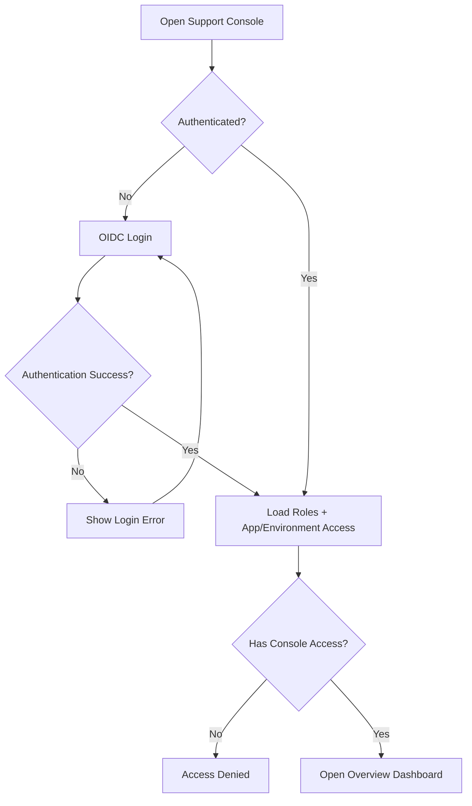

Error states:
- identity provider unavailable;
- authenticated but no application access;
- session expired.

---

# Flow 2 — Dashboard Triage

## Goal
Identify which production issue needs attention first.

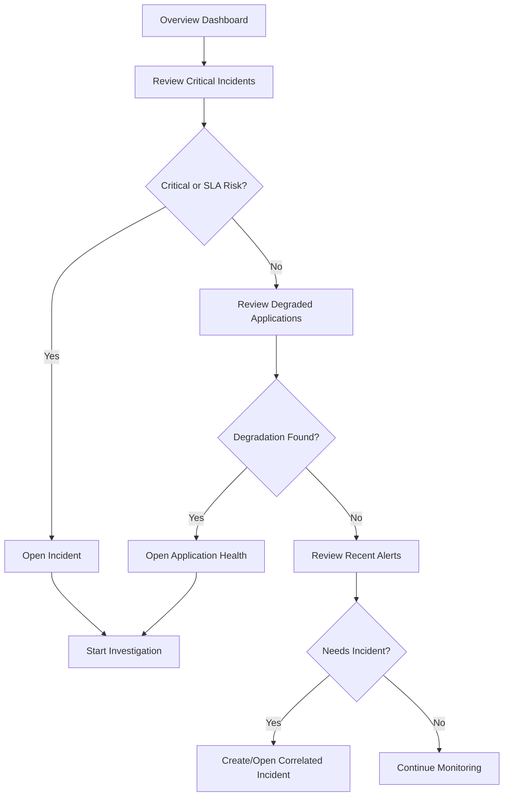

---

# Flow 3 — Alert to Correlated Incident

## Goal
Turn multiple related signals into one operational incident.

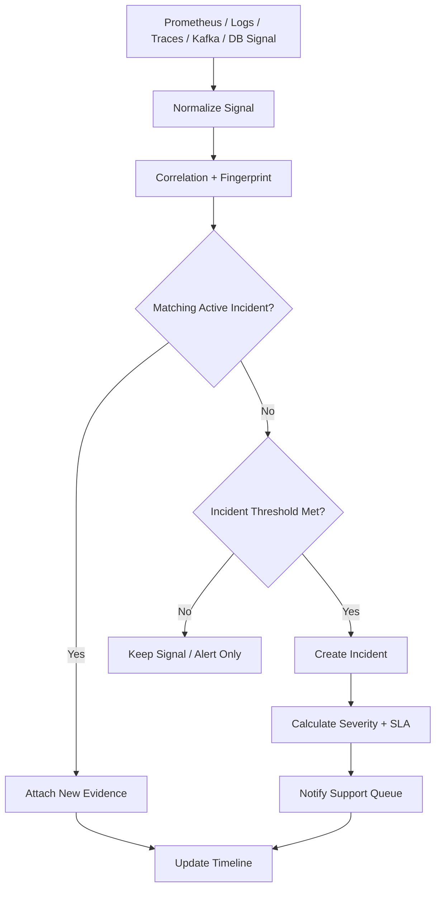

---

# Flow 4 — Acknowledge and Assign Incident

## Goal
Establish ownership quickly.

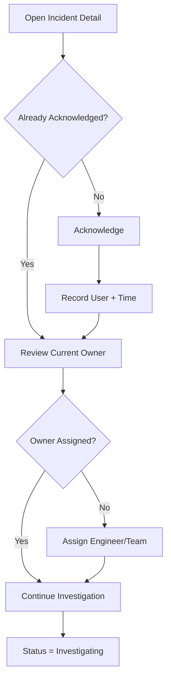

Feedback:
- show SLA timer;
- show assignment confirmation;
- update activity timeline immediately.

---

# Flow 5 — AI-Guided Investigation

## Goal
Use AI to select relevant diagnostic tools and explain evidence.

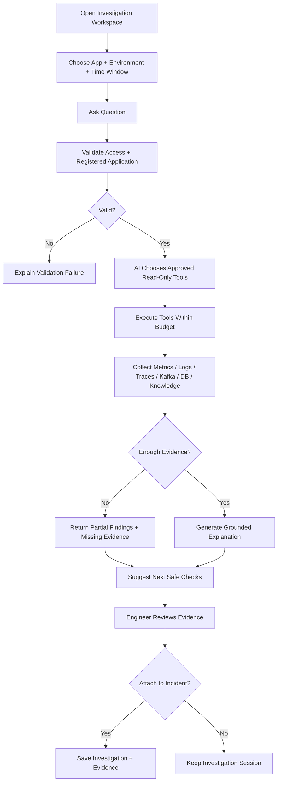

---

# Flow 6 — Drill Down from AI Statement to Evidence

## Goal
Verify why an AI conclusion was made.

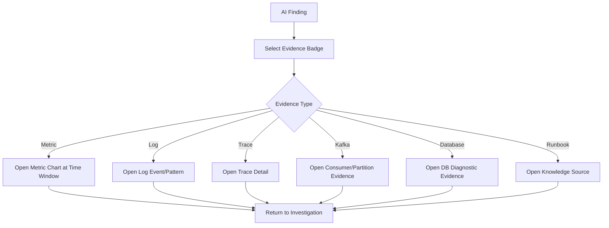

---

# Flow 7 — Metrics Investigation

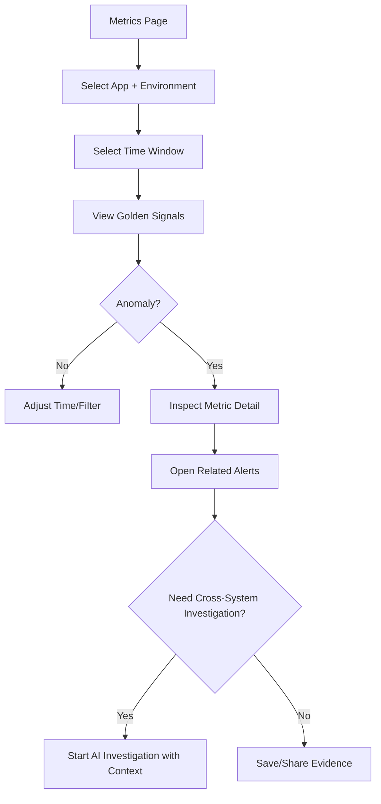

---

# Flow 8 — Log Investigation

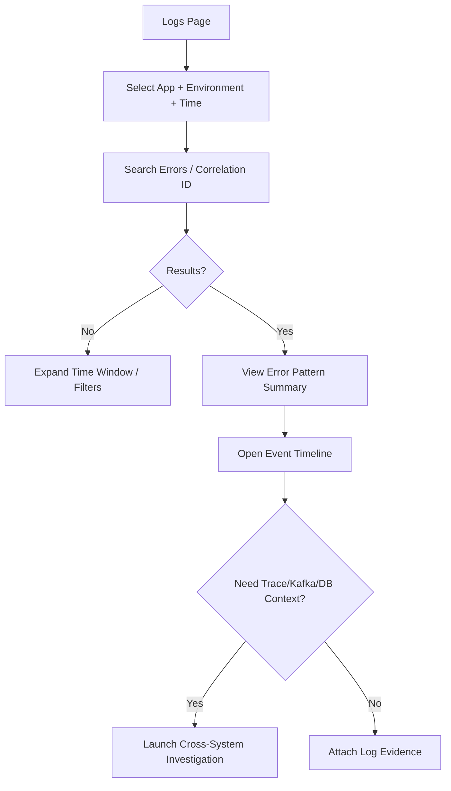

---

# Flow 9 — Trace Investigation

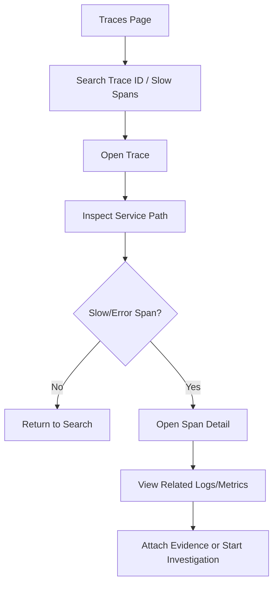

---

# Flow 10 — Kafka Investigation

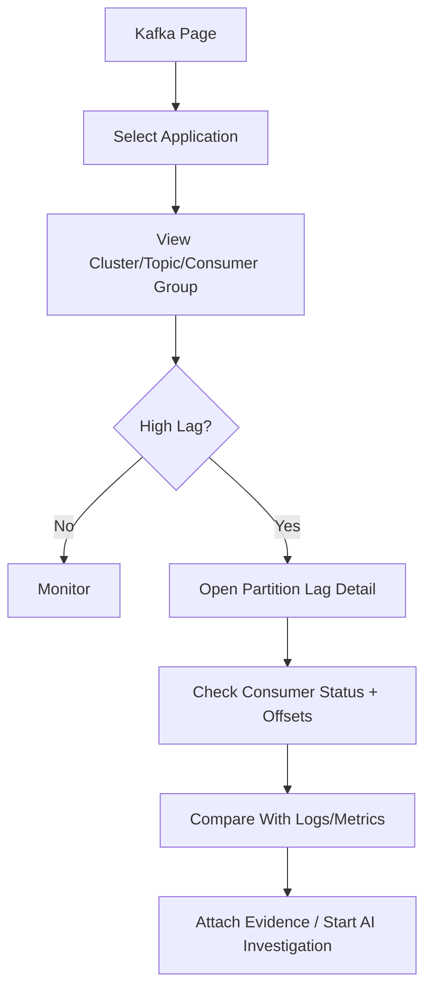

---

# Flow 11 — Database Investigation

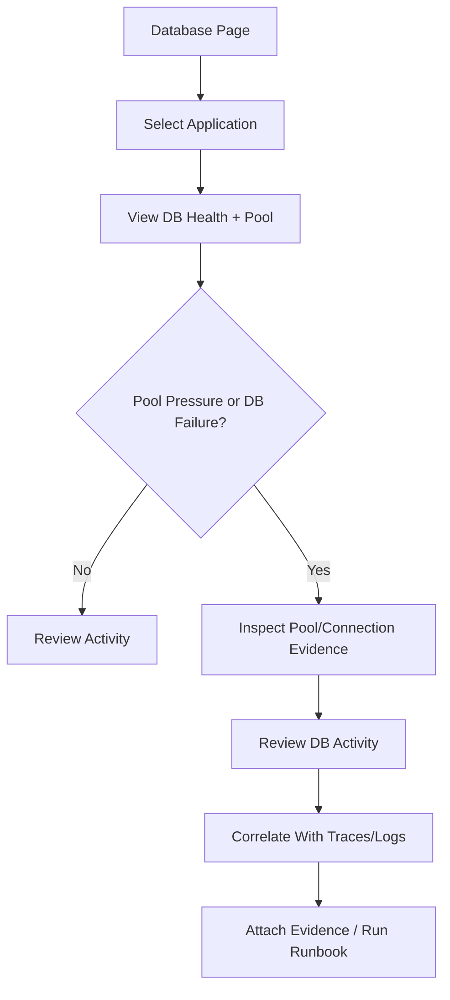

---

# Flow 12 — Knowledge / Runbook Search

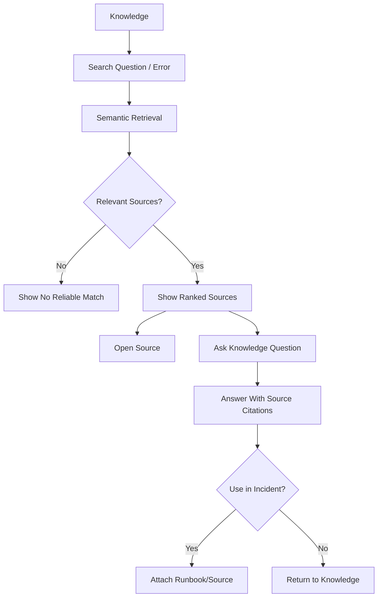

---

# Flow 13 — Incident Escalation

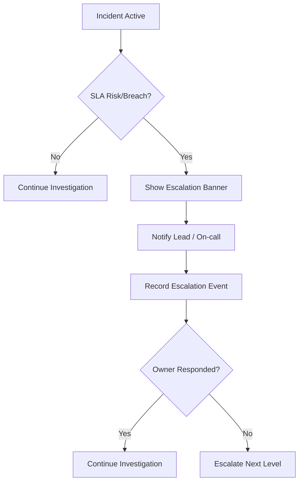

---

# Flow 14 — Resolve Incident

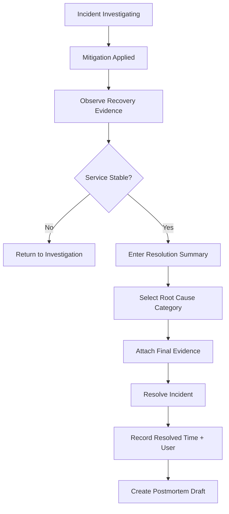

Critical UX rule: resolving an incident is a human decision. AI may propose wording but must not auto-resolve.

---

# Flow 15 — Postmortem Review

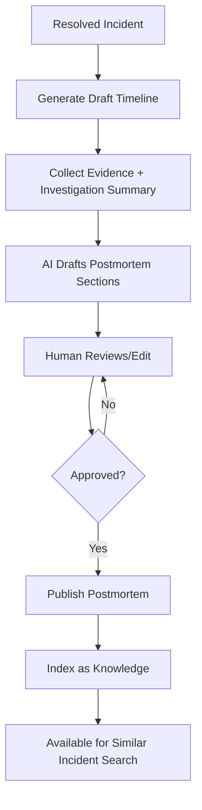

---

# Flow 16 — Application Onboarding

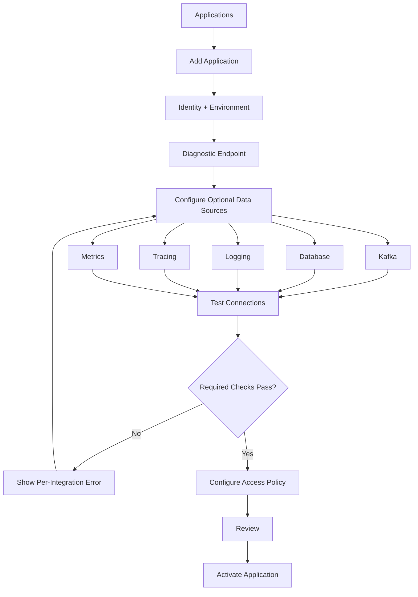

---

# Flow 17 — Investigation Feedback

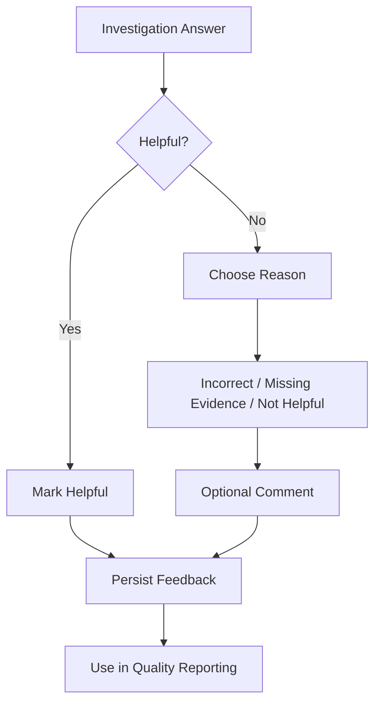

---

# Flow 18 — Degraded Dependency Experience

## Goal
Avoid presenting infrastructure outage as a false "healthy" result.

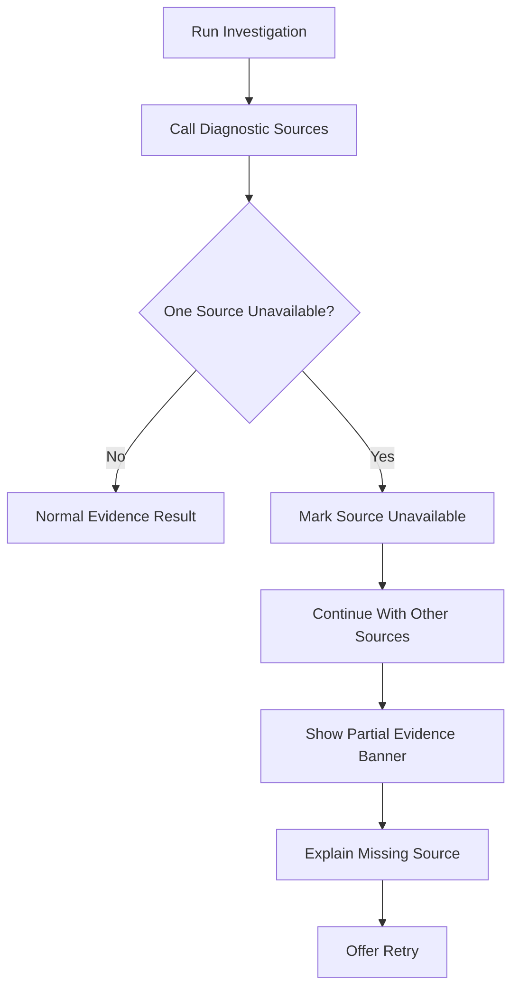

The interface must distinguish:
- no matching evidence;
- source returned zero results;
- source unavailable;
- user lacks permission.
